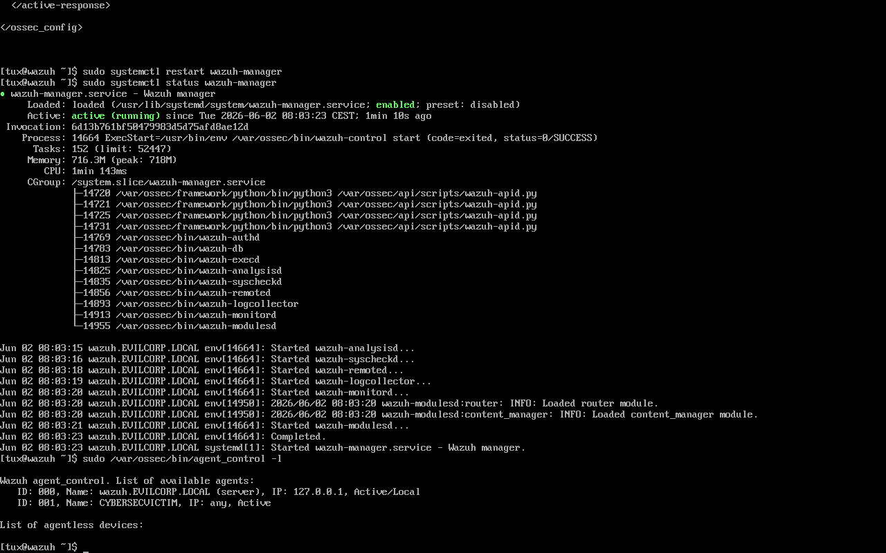
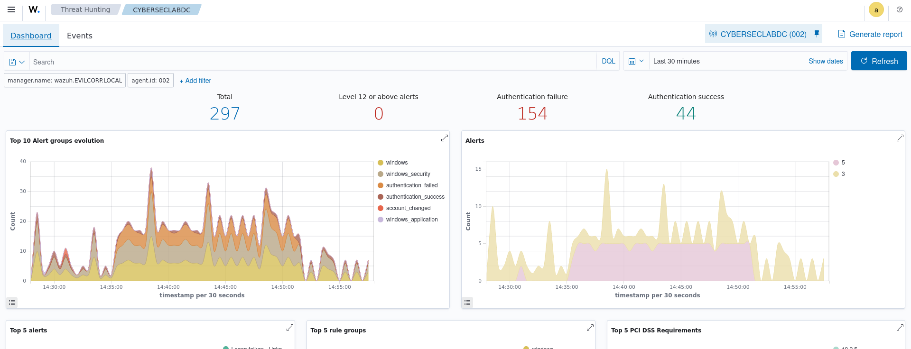

## Security Monitoring Configuration

### Wazuh Deployment & Detection

This section describes the deployment of the monitoring stack and the validation of detection capabilities during attack simulations.

Wazuh Manager Deployment (Linux)

A dedicated Linux virtual machine was configured as the centralized monitoring server.

Primary responsibilities:

Event collection
Agent management
Alert correlation
Security monitoring

Endpoint Monitoring Configuration (Windows)

A Wazuh agent was deployed on the monitored Windows endpoint to forward security-related telemetry to the manager.

Monitored data sources included:

Windows Security Events
Authentication activity
System logs
User activity

## Detection Validation

Attack simulations were performed to validate logging visibility and alert generation.

Kerberoasting Activity

Observed indicators:

Event ID 4769 generated during TGS requests
RC4 encryption usage identified
Authentication activity forwarded to Wazuh

Figure 3: Authentication activity related to Kerberoasting scenario.

Brute Force Activity

Observed indicators:

Event ID 4625 authentication failures
Multiple failed login attempts
Correlated authentication alerts within monitoring platform

### Key Findings

The monitoring stack successfully demonstrated:

Centralized event collection
Endpoint visibility across monitored systems
Authentication monitoring capabilities
Detection support during attack simulation scenarios

The combination of network segmentation and centralized monitoring improved overall defensive visibility within the lab environment.
