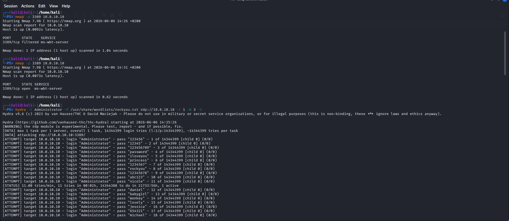
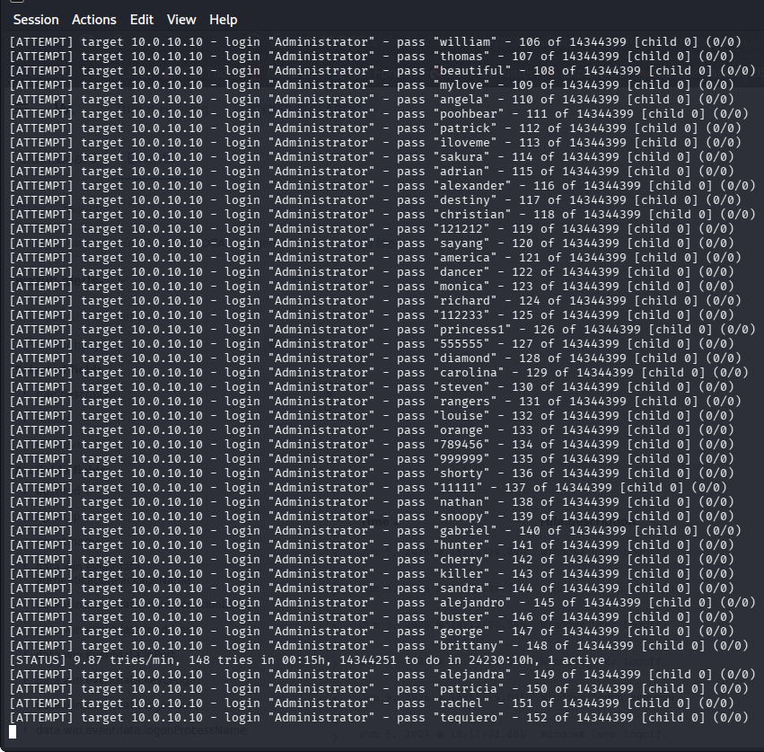

## Brute Force Attack: Detection and Automated Response

This document covers the brute force attack simulation against a Windows Domain Controller and the automated detection + response workflow using Wazuh and pfSense.

### 1. Attack Setup and Execution

The attacker machine `kali` with IP `10.0.20.102` was used to identify and target the Domain Controller.

**Reconnaissance**: An Nmap scan was performed to identify the target `10.0.10.10`.

*Nmap scan from attacker `10.0.20.102` targeting `10.0.10.10` and confirming port 3389 is open.*

**Attack Launch**: Hydra was used to brute force the `Administrator` account on the target `10.0.10.10` using the `rockyou.txt` wordlist.

*Hydra attempting multiple passwords against the `Administrator` account on `10.0.10.10`.*

### 2. Detection on Windows Domain Controller

The attack generated a high volume of Event ID `4625` - An account failed to log on. The Wazuh agent installed on the DC forwarded these events to the Wazuh Manager.

**Event Detail**: The raw Windows Event shows the attack source. `WorkstationName: kali` confirms the brute force originated from the Kali machine.

*Windows Event Viewer showing Event ID 4625. `FailureReason` is `0xC000006D` (bad username or password) and `WorkstationName` is `kali`.*

**Event Volume**: Over 160 failed logon attempts were recorded in under 2 minutes, which is a clear indicator of compromise.

*Event Viewer filtered for Event ID 4625 showing 164 `Audit Failure` events on 6/6/2026.*

### 3. Automated Response with Wazuh + pfSense

Wazuh was configured with an Active Response module to automatically mitigate the attack.

**Workflow**:
1. Wazuh Rule `60122` triggers after multiple `4625` events.
2. The Wazuh Manager executes a custom script on the server.
3. The script connects via SSH to the pfSense firewall at `10.0.10.1`.
4. pfSense executes `easyrule block` to drop all traffic from the attacker's IP `10.0.20.102`.

**Result**: The firewall logs confirm the attacker's IP was blocked after the attack was detected.

*Figure 5: pfSense firewall logs showing `Default deny rule` blocking traffic from `10.0.20.102` after Active Response was triggered.*

### 4. Conclusion
This attack chain demonstrates a complete SOC workflow:
1. **Attack**: Brute force via Hydra from `10.0.20.102`.
2. **Detection**: Windows Event ID 4625 forwarded to Wazuh by the agent.
3. **Response**: Wazuh Active Response automatically instructed pfSense to block the attacker.

The environment successfully detected and contained the brute force attack without manual intervention.
