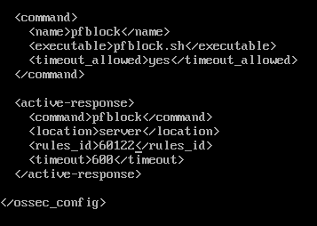

## SOAR: Automated Response with Wazuh Active Response + pfSense

This document covers the SOAR implementation. When Wazuh detects a brute force attack via Rule 60122, it automatically executes a script to block the attacker's IP on the pfSense firewall. Zero manual intervention.

### 1. Active Response Configuration: /var/ossec/etc/ossec.conf

The Wazuh Manager is configured to trigger a custom script when Rule 60122 fires. This rule corresponds to "Logon failure - Unknown user or bad password", i.e., Windows Event ID 4625.

*Figure 1: ossec.conf defines the pfblock command and links it to Rule 60122.*

**Configuration breakdown:**

<command>
<name>pfblock</name>
<executable>pfblock.sh</executable>
<timeout_allowed>yes</timeout_allowed>
</command>

<active-response>
<command>pfblock</command>
<location>server</location>
<rules_id>60122</rules_id>
<timeout>600</timeout>
</active-response>

- **<rules_id>60122</rules_id>**: Triggers on brute force detection.
- **<location>server</location>**: The script runs on the Wazuh Manager itself.
- **<timeout>600</timeout>**: The IP is blocked for 10 minutes, then automatically unblocked.
- **<executable>pfblock.sh</executable>**: The script responsible for firewall interaction.

### 2. Response Script: /var/ossec/active-response/bin/pfblock.sh

This Bash script receives the attacker's IP from Wazuh and uses SSH to execute easyrule on pfSense.

[Figure 2: pfblock.sh Active Response Script](./scripts/PFBLOCK.SH)

The script blocks the attacker's IP via `easyrule block wan` and logs all actions. Wazuh automatically calls it with `delete` after the configured timeout.

**Script logic:**
1.  `ACTION=$1`: Wazuh passes `add` to block, or `delete` to unblock after timeout.
2.  `USER=$2`: Wazuh passes the username targeted by the brute-force attempt.
3.  `IP=$3`: Wazuh passes the attacker's source IP as the third argument.
4.  IP Validation: The script validates the IP using `awk` to ensure only valid IPv4 addresses `0-255` are accepted, preventing command injection.
5.  `ssh admin@10.0.10.1 "easyrule block wan ${IP}"`: Connects to pfSense and creates a firewall rule to drop all traffic from the attacker's IP.
6.  All actions and results are logged to `/var/ossec/logs/active-responses.log` for auditability.

### 3. End-to-End Workflow

1. Attack: Hydra from 10.0.20.102 generates multiple Event ID 4625 on the DC.
2. Detection: Wazuh Agent forwards logs. Wazuh Manager correlates and triggers Rule 60122.
3. Response: The Active Response module executes pfblock.sh add 10.0.20.102.
4. Mitigation: pfSense instantly blocks 10.0.20.102. Attack is contained in < 3 seconds.
5. Recovery: After 600 seconds, Wazuh executes pfblock.sh delete 10.0.20.102 to auto-unblock.

Result: This closed-loop remediation turns the SIEM into an active defense system, reducing Mean Time to Respond (MTTR) from hours to seconds.
