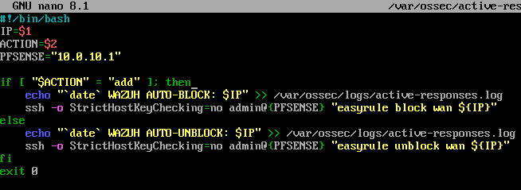

## SOAR: Automated Response with Wazuh and pfSense
This document explains how Wazuh Manager on Linux detects brute force attacks and automatically blocks the attacker via pfSense.

### 1. Detection and Alerting
Wazuh Manager on Linux collects logs from the Windows agent and triggers Rule `60122` when multiple failed logons are detected.

*Figure 1: Wazuh Manager showing Rule 60122 alert for brute force attack.*

### 2. Active Response Script
When triggered, Wazuh executes a custom script located at `/var/ossec/active-response/bin/pfblock.sh` on the Linux Manager.

*Figure 2: `pfblock.sh` script that connects to pfSense via SSH and blocks the attacker's IP using `easyrule`.*

**Script Breakdown**:
bash
#!/bin/bash
IP=$1
ACTION=$2
PFSENSE="10.0.10.1"

if [ "$ACTION" = "add" ]; then
    ssh -o StrictHostKeyChecking=no admin@$PFSENSE "easyrule block wan ${IP}"
else
    ssh -o StrictHostKeyChecking=no admin@$PFSENSE "easyrule unblock wan ${IP}"
fi

- `$1` is the attacker's IP (passed by Wazuh).
- `$2` is `add` (block) or `delete` (unblock).
- `easyrule` is a pfSense command to block/unblock IPs.

3. *Configuration in `ossec.conf`*
The Active Response is configured in `/var/ossec/etc/ossec.conf` on the Wazuh Manager.

!/screenshots/WAZUH_OSSEC_CONFIG.png
Figure 3: `ossec.conf` linking Rule 60122 to the `pfblock.sh` script.

<active-response>
  <command>pfblock</command>
  <location>server</location>
  <rules_id>60122</rules_id>
  <timeout>600</timeout>
</active-response>

<command>
  <name>pfblock</name>
  <executable>pfblock.sh</executable>
  <expect>srcip</expect>
</command>

- *Rule 60122*: Brute force detection.
- *Command*: Executes `pfblock.sh` on the Manager.
- *Timeout*: Blocks IP for 10 minutes (600 seconds).

4. *Result on pfSense*
The attacker's IP `10.0.20.102` is automatically blocked by pfSense.

!/screenshots/PFSENSE_BLOCK_RESULT.png
_Figure 4: pfSense firewall showing `10.0.20.102` blocked by the `easyrule` command._

5. *Conclusion*
This SOAR workflow demonstrates:
1. Wazuh detects brute force on Windows via Event ID 4625.
2. Wazuh Manager on Linux triggers an Active Response.
3. The script blocks the attacker at the firewall level (pfSense).
4. The IP is blocked for 10 minutes, then automatically unblocked.

This automated response reduces response time from hours to seconds.
